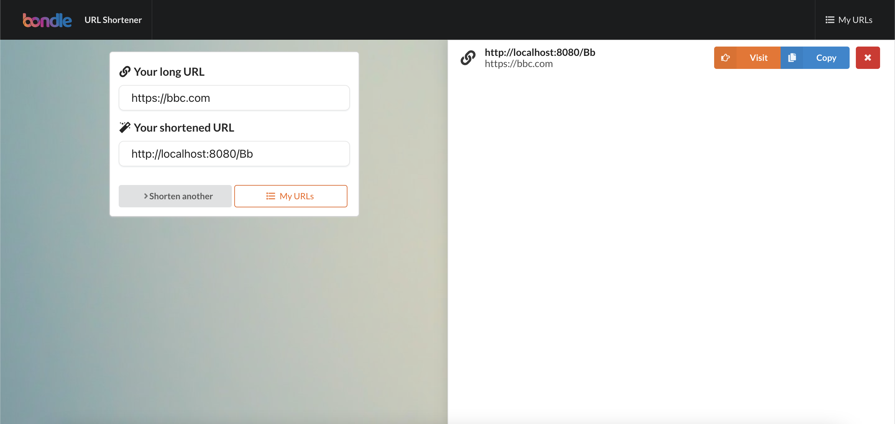

# Bondle shorten url
# 

## Features:
The user wants a URL shortener application. They should be able to provide a url and get a
shortened url for it. When a shortened url is provided, the user should be redirected to the
original url.
1. Create a simple web application that
a. Uses Springboot framework
b. Presents a web interface to user
2. User should be able to
a. Submit a URL via form
b. Response should be shortened URL
3. User should be able to
a. Submit a shortened URL via form
b. Get redirected to original URL
4. Ther User should be able to see a list of previous shortened URLs
5. BONUS: Front end communicates to backend via REST API

## Requirements:
- Node: v14.15.4 
- Yarn: 1.22.10
- Docker: 20.10.5
- Docker-Compose: 1.28.5
- Maven: 3.6.3
- Java: 11
## Start local

1. Service up
```bash
develop/up
```
2. Service down
```bash
develop/down
```
3. After service up, access page site: [http://localhost](http://localhost)

4. Access swagger docs for backend API: [http://localhost:8080/swagger-ui/index.html](http://localhost:8080/swagger-ui/index.html)

## Live site
[https://bondle.fullbrightday.com](https://bondle.fullbrightday.com)
